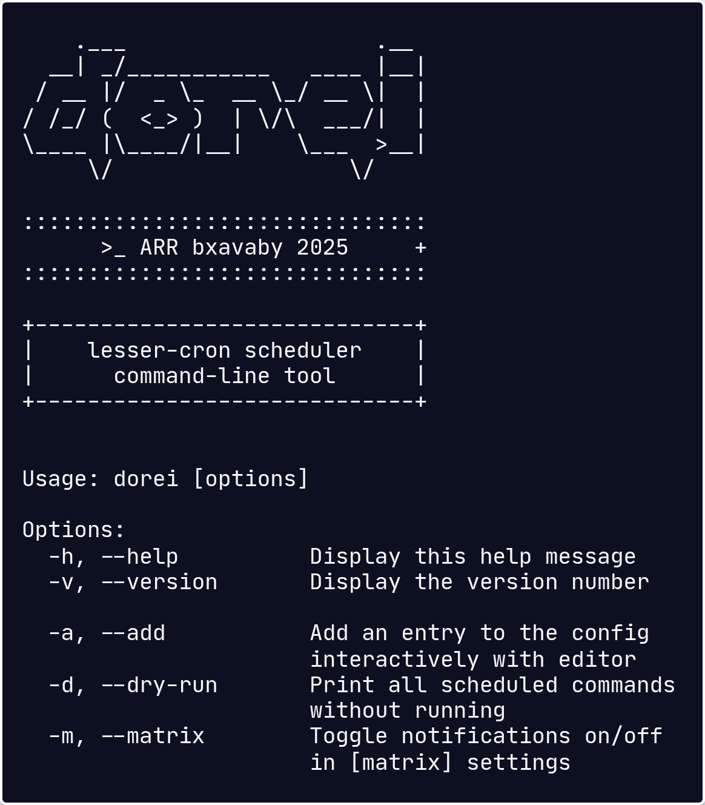

<div align="center">


───────────────────


# _dorei_

### A *lesser-cron* that pairs absolute granuality (second) with a simplified interval format

<br>



<br><br>

<div align="left">

## Roadmap

- [x] Some basic, but COOL flags (needs expansion)
- [x] Config at ~/.config/dorei/dorei.conf
- [ ] System shell execution (no sandboxing)
- [ ] Simple error handling (log + continue)
- [ ] Concurrent timers (1 goroutine per task)
- [ ] Log notifications via matrix (notify)
- [ ] ...
- [ ] Nix-shell command wrapper ([nix] prefix in config)
- [ ] Hot-reload dorei.conf (avoid daemon restart)
- [ ] More notification services w/ notify
- [ ] Docker instead or in addition to nix-shell
- [ ] Prometheus metrics for monitoring
- [ ] Frontend??

<br>

## Safety Mechanisms

- [ ] Blacklist dangerous commands like ```rm -rf``` and ```:(){:|:&};:```
- [ ] Dry-run option, to print the scheduled commands
- [ ] Editor list matching, to prevent stupid errors
- [ ] Logging w/ timestamp via cli or matrix (if enabled)
- [ ] More to come ([Suggest Feature](../../issues))

</div>

<br>

───────────────────

*Hope this will serve you somehow.*

**[Report Bug](../../issues)** | **[Suggest Feature](../../issues)**

**MIT License © 2025 bxavaby**

</div>
